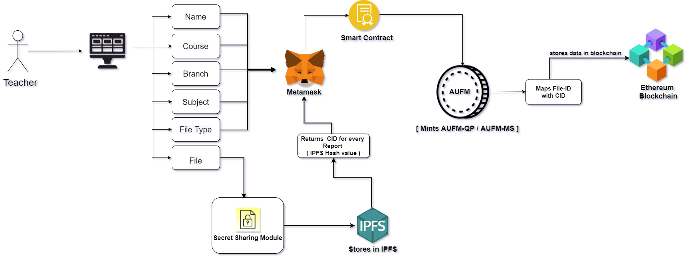
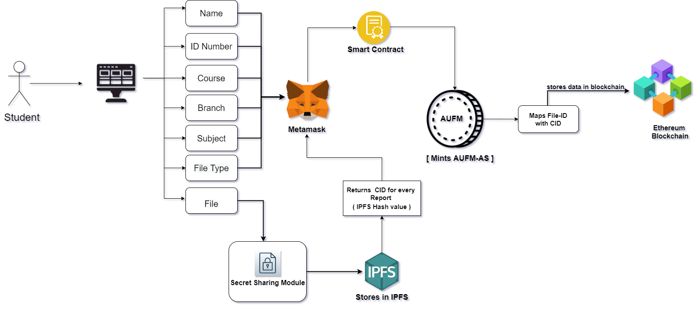
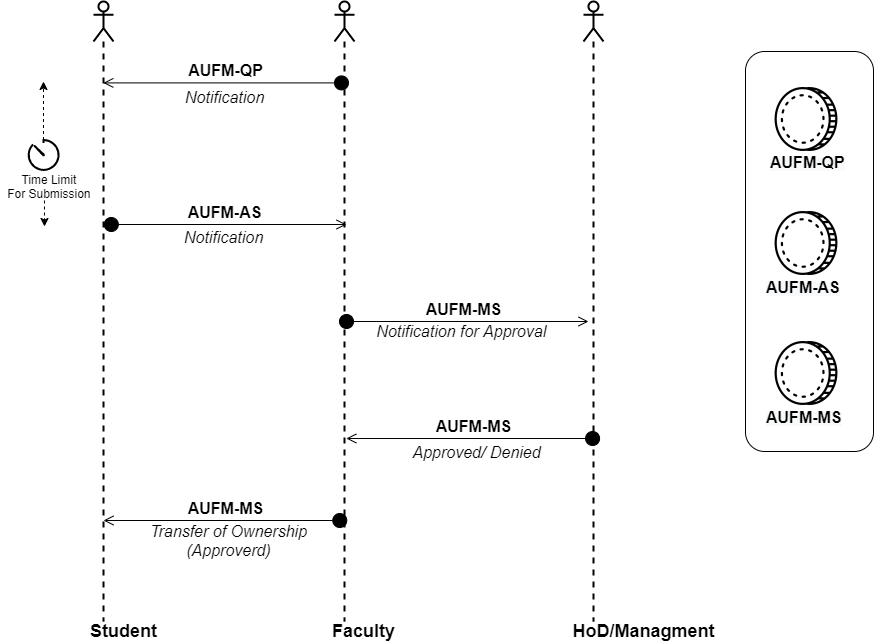

# University Management System based on Distributed Ledger

## Abstract 

## Proposed Architecture 

## Usecases 
- Flow-graph for Teacher

 

  
  

- Flow-graph for Student

 

  
  

  
  - Ownership Transferring with ERC-721 Token

 

  
  
 

## Demo
[Click here](https://amrita-tifac-cyber-blockchain.github.io/University-Management-System/UI/html/index.html) to access the webpage.

## Acknowledgement 
We would like to acknowldge the support provided by TIFAC-CORE in Cyber Security, Amrita School of Engineering, Amrita Vishwa Vidyapeetham, Coimbatore in carrying out this work as part of "Blockchain Technology" Course. 

## References
-  A.  K.  Shrivastava,  C.  Vashistth,  A.  Rajak  and  A.  K.  Tripathi,  ”A  Decen-tralized  Way  to  Store  and  Authenticate  Educational  Documents  on  PrivateBlockchain,”  2019  International  Conference  on  Issues  and  Challenges  in  Intelli-gent  Computing  Techniques  (ICICT),  GHAZIABAD,  India,  2019,  pp.  1-6,  doi:10.1109/ICICT46931.2019.8977633.

-  U.  Marjit  and  P.  Kumar,  ”Towards  a  Decentralized  and  Distributed  Frameworkfor  Open  Educational  Resources  based  on  IPFS  and  Blockchain,”  2020  Interna-tional Conference on Computer Science, Engineering and Applications (ICCSEA),Gunupur, India, 2020, pp. 1-6, doi: 10.1109/ICCSEA49143.2020.9132841.

- Ramaguru  R,  Minu  M.  Blockchain  Terminologies.  NamChain  Open  InitiativeResearch   Lab   (2021).   https://github.com/NamChain-Open-Initiative-Research-Lab/Blockchain-Terminologies

- Kripa  M.,  Nidhin  Mahesh  A.,  Ramaguru  R.,  Amritha  P.P.  (2021)  BlockchainFramework  for  Social  Media  DRM  Based  on  Secret  Sharing.  In:  Senjyu  T.,  Ma-halle P.N., Perumal T., Joshi A. (eds) Information and Communication Technologyfor Intelligent Systems. ICTIS 2020. Smart Innovation, Systems and Technologies,vol 195. Springer, Singapore. https://doi.org/10.1007/978-981-15-7078-043

- Amrita University Management System(AUMS).https://www.amrita.edu/aums/about
