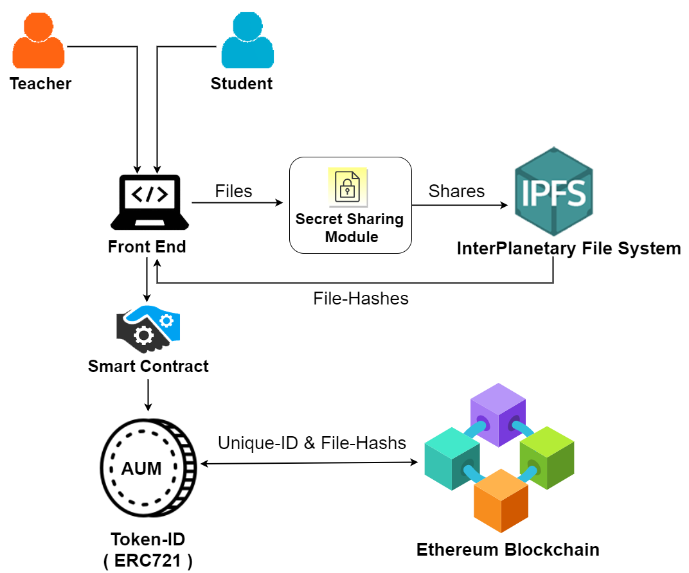
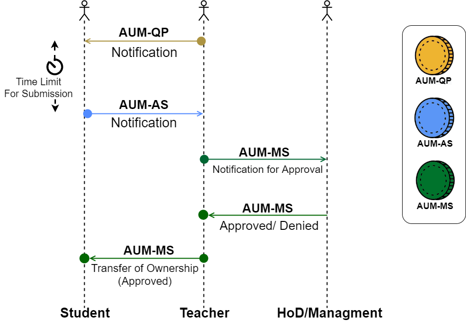
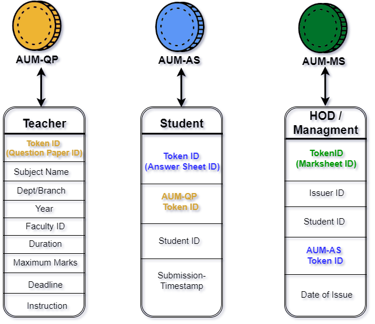
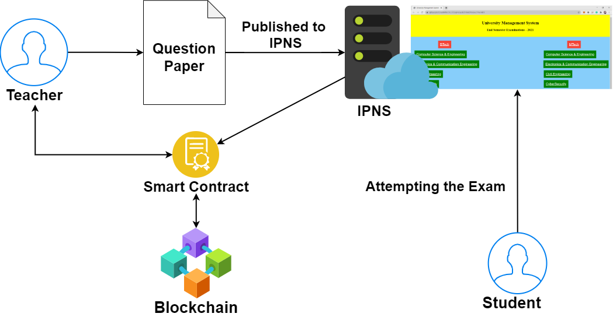

# Distributed Ledger Framework for an Adaptive University Management System

## Abstract 
The true power and the state of any technology are best known during difficult times. The yet-to-over COVID-19 lockdown has unleashed the power of online
and remote modes of learning, evaluation, and working. The universities and educational institutions worldwide faced their big-time challenge in delivering, managing,
evaluating their student’s learning progress. The need for an online-virtual-remote learning platform has become inevitable, which comes with a multitude of challenges, including usability, security, privacy, and real-time adoption. In this paper, we propose an Adaptive University Management System Framework (UMS) based on Distributed Ledger Technology (DLT) like EthereumBlockchainwherewe record the schedules, the delivered classes, the materials and track the student’s learning progress with the use of ERC-721 standard to tokenize the submissions&evaluations. To provide efficient and effective utilization, the learning materials and submissions made onto the system are stored in Distributed File Storage system - InterPlanetary File System (IPFS) and hosted in InterPlanetary Name System (IPNS) with files securely split using a secret sharing algorithm.

## Proposed Architecture 

## Usecases 
- **Flow-graph for Teacher**

 

  
  

- **Flow-graph for Student**

 

  
  

  
## Ownership Transferring with ERC-721 Token

 

  
  
 
  
## Token Details 

 

  
  
 
  
## Online Exam Architecture 
  
 

  
  
 

## Demo
[Click here](https://amrita-tifac-cyber-blockchain.github.io/Distributed-Ledger-Framework-for-an-Adaptive-University-Management-System//UI/html/index.html) to access the webpage.

## Acknowledgement 
We would like to acknowldge the support provided by TIFAC-CORE in Cyber Security, Amrita School of Engineering, Amrita Vishwa Vidyapeetham, Coimbatore in carrying out this work as part of "Blockchain Technology" Course. 

## References
-  A.  K.  Shrivastava,  C.  Vashistth,  A.  Rajak  and  A.  K.  Tripathi,  ”A  Decen-tralized  Way  to  Store  and  Authenticate  Educational  Documents  on  PrivateBlockchain,”  2019  International  Conference  on  Issues  and  Challenges  in  Intelli-gent  Computing  Techniques  (ICICT),  GHAZIABAD,  India,  2019,  pp.  1-6,  doi:10.1109/ICICT46931.2019.8977633.

-  U.  Marjit  and  P.  Kumar,  ”Towards  a  Decentralized  and  Distributed  Frameworkfor  Open  Educational  Resources  based  on  IPFS  and  Blockchain,”  2020  Interna-tional Conference on Computer Science, Engineering and Applications (ICCSEA),Gunupur, India, 2020, pp. 1-6, doi: 10.1109/ICCSEA49143.2020.9132841.

- Ramaguru  R,  Minu  M.  Blockchain  Terminologies.  NamChain  Open  InitiativeResearch   Lab   (2021).   https://github.com/NamChain-Open-Initiative-Research-Lab/Blockchain-Terminologies

- Kripa  M.,  Nidhin  Mahesh  A.,  Ramaguru  R.,  Amritha  P.P.  (2021)  BlockchainFramework  for  Social  Media  DRM  Based  on  Secret  Sharing.  In:  Senjyu  T.,  Ma-halle P.N., Perumal T., Joshi A. (eds) Information and Communication Technologyfor Intelligent Systems. ICTIS 2020. Smart Innovation, Systems and Technologies,vol 195. Springer, Singapore. https://doi.org/10.1007/978-981-15-7078-043

- Amrita University Management System(AUMS).https://www.amrita.edu/aums/about

## Publications 

